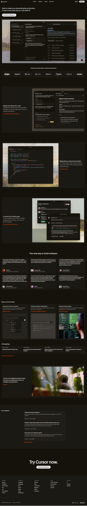

Link to : [Live Demo](https://king-sama312.github.io/Cursor-ui-clone/)

# Cursor-Inspired Developer Tool Landing Page

This project is a **desktop-first landing page** inspired by the design and structure of the Cursor website.  
The primary objective was to recreate the **visual layout, hierarchy, typography, and spacing** as closely as possible using only **HTML and CSS**.

No animations, responsiveness, JavaScript, frameworks, or AI tools were used in this implementation.

---

## 📌 Project Objective

Recreate a developer-tool style landing page that closely matches the original Cursor website in:

- Page structure and section order
- Typography and font styling
- Color palette
- Spacing and layout alignment
- Visual hierarchy

The focus of this assignment is **accuracy**, not creativity or interactivity.

---

## 🧱 Sections Recreated

The following sections were implemented:

### 1. Top Navigation Bar
- Logo (Cursor-inspired branding)
- Navigation links
- Primary Call-To-Action button
- Dark background
- Horizontal alignment with consistent spacing

### 2. Hero Section
- Large bold headline
- Supporting description
- Primary CTA button
- Product screenshot positioned prominently
- Clear visual hierarchy

### 3. Trusted By / Logos Section
- Horizontal row of company logos
- Muted styling for subtle trust indicators
- Even spacing between logos

### 4. Feature Sections (3 Blocks)
- Two-column layout (Text + Image)
- Alternating layout (Image left/right)
- Clear section separation
- Balanced white space

### 5. Feature Cards Section
- Section title
- Grid layout of 3–4 feature cards
- Card background contrast
- Title + short description per card

### 6. Testimonials Section
- Quote-style cards
- Name and role displayed
- Structured spacing and consistent alignment

### 7. Use Cases / Stories Section
- Image + short description cards
- Horizontal card layout
- Minimal design for clarity

### 8. Changelog / Updates Section
- Date + update title
- Clean list layout
- Subtle divider lines

### 9. Team / About Section
- Large image
- Short descriptive paragraph
- Supporting CTA button

### 10. Final CTA Section
- Large bold heading
- Single strong CTA button
- High contrast background

### 11. Footer
- Multi-column layout
- Company links
- Product links
- Legal links
- Copyright information

---

## 🎨 Fonts Used

- **Inter** (Primary font)
- Sans-serif fallback stack

Font was chosen to closely match the modern developer-focused aesthetic of the reference design.

---

## 🎨 Color Palette

The design closely follows a dark-first minimal aesthetic.

### Primary Colors
- Background: `#0B0F19` (Dark navy/black tone)
- Secondary Background: `#111827`
- Card Background: `#1F2937`
- Accent / CTA: `#6366F1` (Indigo)
- Light Text: `#F9FAFB`
- Muted Text: `#9CA3AF`
- Borders: `#374151`

Spacing and section separation were carefully adjusted to reflect the original site structure.

---

## 🧩 Technologies Used

- HTML5 (Semantic structure)
- CSS3 (Flexbox + Grid)
- No JavaScript
- No frameworks
- No TailwindCSS
- No animations
- Desktop-only layout

---

## 📷 Screenshots

Include screenshots of:

- Full page view
- Hero section
- Feature grid
- Testimonials
- Footer

Recommended file structure:
